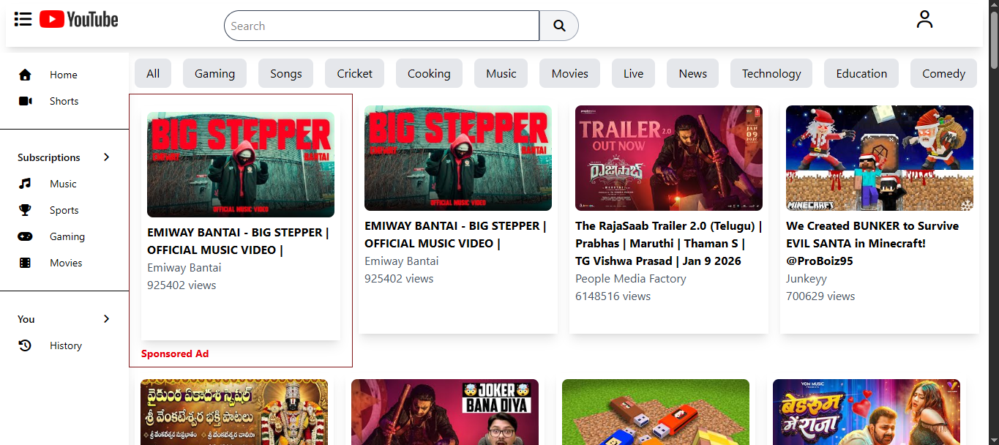
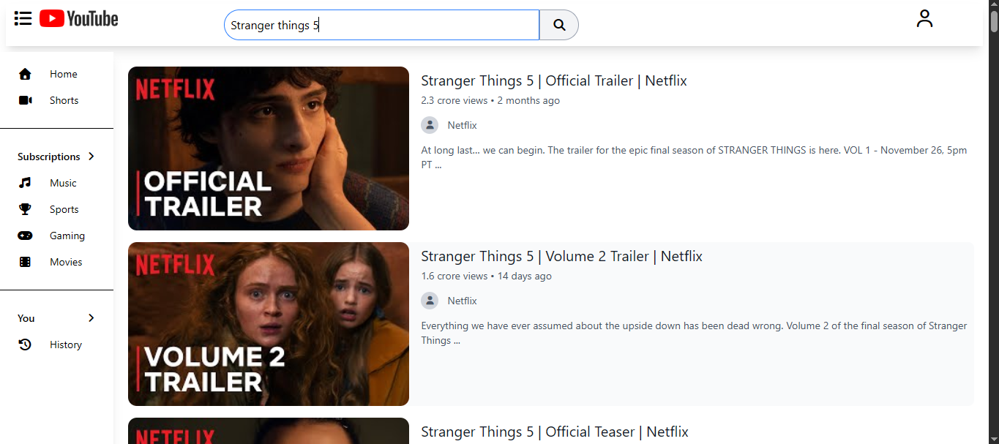
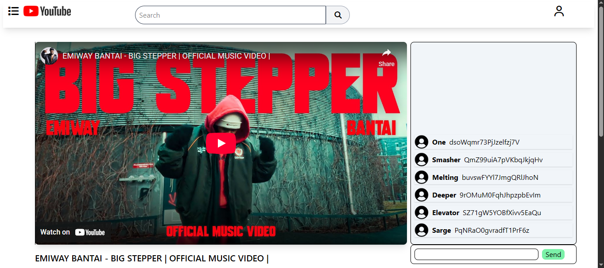
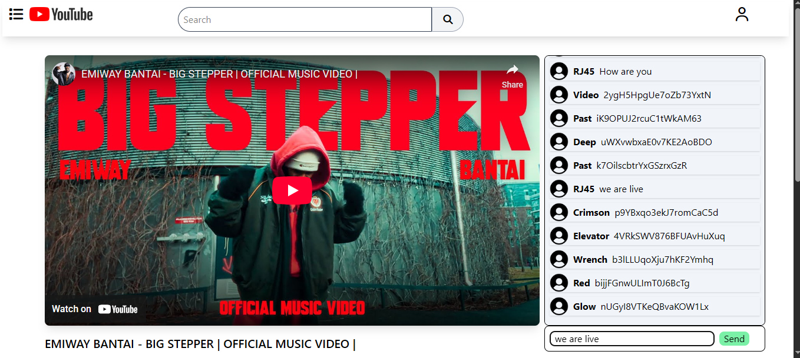
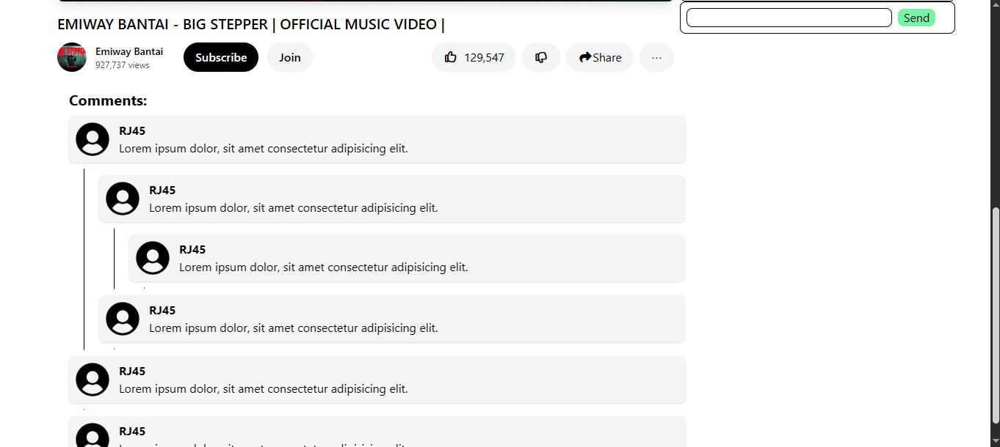

# YouTube Clone

A modern YouTube clone built with React, Redux Toolkit, and Tailwind CSS. This project replicates core YouTube features including video browsing, search functionality, video playback, live chat simulation, and comments section.

🔗 **Live Demo:** [https://clone-youtub-787fe.web.app](https://clone-youtub-787fe.web.app)

## ✨ Features

- **🎥 Video Browsing**: Browse popular YouTube videos with thumbnails, titles, and channel information

  

- **🔍 Search Functionality**: Real-time search suggestions and search results

  

- **▶️ Video Player**: Embedded YouTube video player with full playback controls

  

- **💬 Live Chat Simulation**: Real-time simulated live chat with using store

  

- **📝 Comments Section**: Display and browse video comments

  

- **🎨 Modern UI**: Clean and intuitive user interface similar to YouTube

- **🔄 State Management**: Efficient state management using Redux Toolkit

## 🛠️ Tech Stack

- **Frontend Framework**: React 19
- **State Management**: Redux Toolkit
- **Routing**: React Router DOM
- **Styling**: Tailwind CSS 4.1
- **Build Tool**: Vite 7
- **Deployment**: Firebase Hosting
- **API**: YouTube Data API v3

## 📦 Project Structure

```
youtube-clone/
├── public/              # Static assets
├── src/
│   ├── assets/          # Images and media files
│   ├── components/      # React components
│   │   ├── Body.jsx
│   │   ├── Button.jsx
│   │   ├── ButtonList.jsx
│   │   ├── ChatMessage.jsx
│   │   ├── Comment.jsx
│   │   ├── CommentsConatainer.jsx
│   │   ├── Header.jsx
│   │   ├── Layout.jsx
│   │   ├── LiveChat.jsx
│   │   ├── MainContainer.jsx
│   │   ├── SearchResults.jsx
│   │   ├── Sidebar.jsx
│   │   ├── VideoCard.jsx
│   │   ├── VideoContainer.jsx
│   │   └── WatchPage.jsx
│   ├── utils/           # Utility functions and Redux slices
│   │   ├── appSlice.jsx
│   │   ├── chatSlice.jsx
│   │   ├── constants.jsx
│   │   ├── firebase.jsx
│   │   ├── helper.jsx
│   │   ├── searchSlice.jsx
│   │   └── store.jsx
│   ├── App.css
│   ├── App.jsx
│   ├── index.css
│   └── main.jsx
├── firebase.json        # Firebase configuration
├── package.json
├── vite.config.js
└── README.md
```

## 🚀 Getting Started

### Prerequisites

- Node.js (v16 or higher)
- npm or yarn
- YouTube Data API v3 key

### Installation

1. **Clone the repository**

   ```bash
   git clone https://github.com/yourusername/youtube-clone.git
   cd youtube-clone
   ```

2. **Install dependencies**

   ```bash
   npm install
   ```

3. **Set up environment variables**

   Create a `.env` file in the root directory and add your YouTube API key:

   ```
   VITE_GOOGLE_API_KEY=your_youtube_api_key_here
   ```

   To get a YouTube API key:

   - Go to [Google Cloud Console](https://console.cloud.google.com/)
   - Create a new project or select an existing one
   - Enable YouTube Data API v3
   - Create credentials (API Key)

4. **Start the development server**

   ```bash
   npm run dev
   ```

5. **Open your browser**

   Navigate to `http://localhost:5173` (or the port shown in your terminal)

## 📝 Available Scripts

- `npm run dev` - Start development server
- `npm run build` - Build for production
- `npm run preview` - Preview production build
- `npm run lint` - Run ESLint

## 🔑 Key Features Explained

### Video Browsing

Browse through the most popular videos in your region with thumbnail previews, titles, channel names, and view counts.

### Search Functionality

- Real-time search suggestions as you type
- Comprehensive search results page
- Integration with YouTube's autocomplete API

### Watch Page

- Full video playback with embedded YouTube player
- Video information including title, channel, views, and likes
- Subscribe and action buttons
- Live chat simulation on the side

### Live Chat

- Simulated live chat with random messages
- API polling every 2 seconds for new messages
- Interactive chat where users can send messages
- Smooth scrolling and message updates

### State Management

Redux Toolkit is used to manage:

- Menu toggle state (sidebar)
- Chat messages
- Search cache
- Application-wide state

## 🌐 Deployment

This project is deployed on Firebase Hosting. To deploy your own version:

1. Install Firebase CLI:

   ```bash
   npm install -g firebase-tools
   ```

2. Login to Firebase:

   ```bash
   firebase login
   ```

3. Initialize Firebase (if not already done):

   ```bash
   firebase init
   ```

4. Build and deploy:
   ```bash
   npm run build
   firebase deploy
   ```

## 👏 Acknowledgments

- YouTube for the inspiration and API
- React and Redux teams for excellent documentation
- Tailwind CSS for the utility-first CSS framework
- Vite for the blazing fast build tool

## 📧 Contact

For any queries or suggestions, feel free to reach out!

---

**Note**: This is a clone project created for educational purposes. All YouTube-related trademarks and assets belong to Google LLC.
